# [Порождающие паттерны](https://refactoring.guru/ru/design-patterns/creational-patterns) (Creational patterns)

<details> 
<summary>Псевдокод</summary>
<p>

```java

```

</p>
</details>

### Абстрактная фабрика (Abstract factory)
[Абстрактная фабрика](https://refactoring.guru/ru/design-patterns/abstract-factory) — это порождающий паттерн проектирования, который позволяет создавать семейства связанных объектов, не привязываясь к конкретным классам создаваемых объектов.

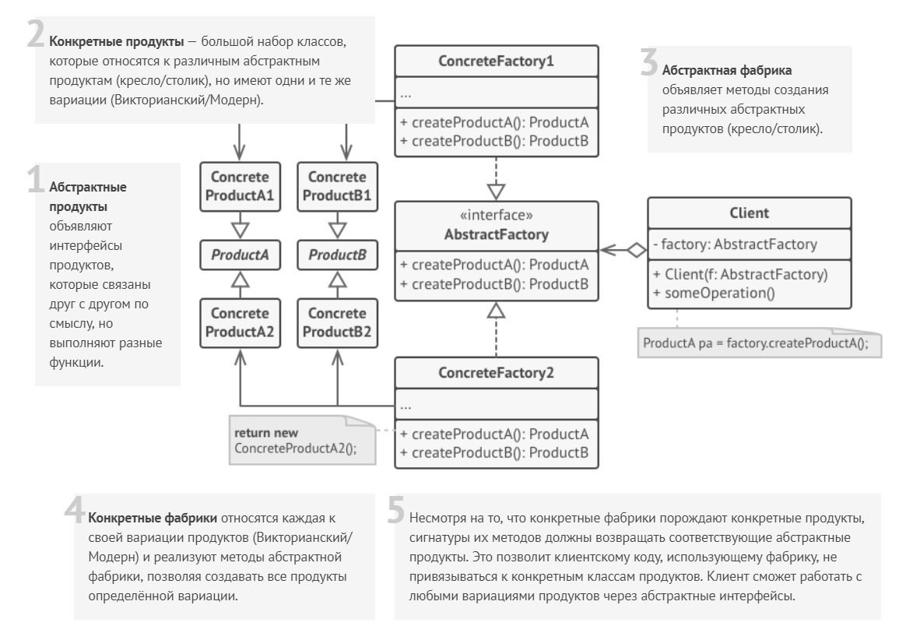

<details> 
<summary>Псевдокод</summary>
<p>

```java
// Этот паттерн предполагает, что у вас есть несколько семейств
// продуктов, находящихся в отдельных иерархиях классов
// (Button/Checkbox). Продукты одного семейства должны иметь
// общий интерфейс.
interface Button is
    method paint()

// Семейства продуктов имеют те же вариации (macOS/Windows).
class WinButton implements Button is
    method paint() is
        // Отрисовать кнопку в стиле Windows.

class MacButton implements Button is
    method paint() is
        // Отрисовать кнопку в стиле macOS.


interface Checkbox is
    method paint()

class WinCheckbox implements Checkbox is
    method paint() is
        // Отрисовать чекбокс в стиле Windows.

class MacCheckbox implements Checkbox is
    method paint() is
        // Отрисовать чекбокс в стиле macOS.


// Абстрактная фабрика знает обо всех абстрактных типах
// продуктов.
interface GUIFactory is
    method createButton():Button
    method createCheckbox():Checkbox


// Каждая конкретная фабрика знает и создаёт только продукты
// своей вариации.
class WinFactory implements GUIFactory is
    method createButton():Button is
        return new WinButton()
    method createCheckbox():Checkbox is
        return new WinCheckbox()

// Несмотря на то, что фабрики оперируют конкретными классами,
// их методы возвращают абстрактные типы продуктов. Благодаря
// этому фабрики можно взаимозаменять, не изменяя клиентский
// код.
class MacFactory implements GUIFactory is
    method createButton():Button is
        return new MacButton()
    method createCheckbox():Checkbox is
        return new MacCheckbox()


// Для кода, использующего фабрику, не важно, с какой конкретно
// фабрикой он работает. Все получатели продуктов работают с
// ними через общие интерфейсы.
class Application is
    private field button: Button
    constructor Application(factory: GUIFactory) is
        this.factory = factory
    method createUI()
        this.button = factory.createButton()
    method paint()
        button.paint()


// Приложение выбирает тип конкретной фабрики и создаёт её
// динамически, исходя из конфигурации или окружения.
class ApplicationConfigurator is
    method main() is
        config = readApplicationConfigFile()

        if (config.OS == "Windows") then
            factory = new WinFactory()
        else if (config.OS == "Web") then
            factory = new MacFactory()
        else
            throw new Exception("Error! Unknown operating system.")

        Application app = new Application(factory)
```

</p>
</details>


### Фабричный метод (Factory method)
[Фабричный метод](https://refactoring.guru/ru/design-patterns/factory-method) — это порождающий паттерн проектирования, который определяет общий интерфейс для создания объектов в суперклассе, позволяя подклассам изменять тип создаваемых объектов.

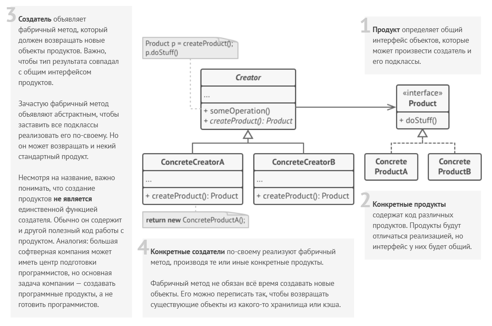

<details> 
<summary>Псевдокод</summary>
<p>

```java
// Паттерн Фабричный метод применим тогда, когда в программе
// есть иерархия классов продуктов.
interface Button is
    method render()
    method onClick(f)

class WindowsButton implements Button is
    method render(a, b) is
        // Отрисовать кнопку в стиле Windows.
    method onClick(f) is
        // Навесить на кнопку обработчик событий Windows.

class HTMLButton implements Button is
    method render(a, b) is
        // Вернуть HTML-код кнопки.
    method onClick(f) is
        // Навесить на кнопку обработчик события браузера.


// Базовый класс фабрики. Заметьте, что "фабрика" — это всего
// лишь дополнительная роль для класса. Скорее всего, он уже
// имеет какую-то бизнес-логику, в которой требуется создание
// разнообразных продуктов.
class Dialog is
    method renderWindow() is
        // Чтобы использовать фабричный метод, вы должны
        // убедиться в том, что эта бизнес-логика не зависит от
        // конкретных классов продуктов. Button — это общий
        // интерфейс кнопок, поэтому все хорошо.
        Button okButton = createButton()
        okButton.onClick(closeDialog)
        okButton.render()

    // Мы выносим весь код создания продуктов в особый метод,
    // который назвают "фабричным".
    abstract method createButton()


// Конкретные фабрики переопределяют фабричный метод и
// возвращают из него собственные продукты.
class WindowsDialog extends Dialog is
    method createButton() is
        return new WindowsButton()

class WebDialog extends Dialog is
    method createButton() is
        return new HTMLButton()


class ClientApplication is
    field dialog: Dialog

    // Приложение создаёт определённую фабрику в зависимости от
    // конфигурации или окружения.
    method initialize() is
        config = readApplicationConfigFile()

        if (config.OS == "Windows") then
            dialog = new WindowsDialog()
        else if (config.OS == "Web") then
            dialog = new WebDialog()
        else
            throw new Exception("Error! Unknown operating system.")

    // Если весь остальной клиентский код работает с фабриками и
    // продуктами только через общий интерфейс, то для него
    // будет не важно, какая фабрика была создана изначально.
    method main() is
        dialog.initialize()
        dialog.render()
```
</p>
</details>

### Строитель (Builder)
[Строитель](https://refactoring.guru/ru/design-patterns/builder) — это порождающий паттерн проектирования, который позволяет создавать сложные объекты пошагово. Строитель даёт возможность использовать один и тот же код строительства для получения разных представлений объектов.

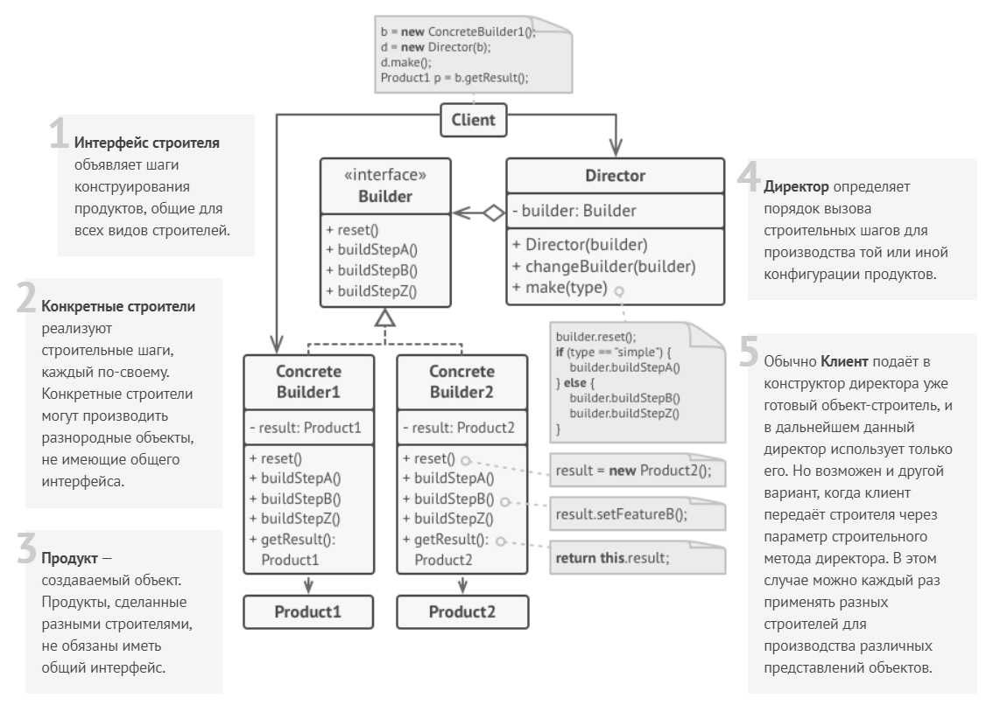

<details> 
<summary>Псевдокод</summary>
<p>

```java
// Строитель может создавать различные продукты, используя один
// и тот же процесс строительства.
class Car is
    // Автомобили могут отличаться комплектацией: типом
    // двигателя, количеством сидений, могут иметь или не иметь
    // GPS и систему навигации и т. д. Кроме того, автомобили
    // могут быть городскими, спортивными или внедорожниками.

class Manual is
    // Руководство пользователя для данной конфигурации
    // автомобиля.


// Интерфейс строителя объявляет все возможные этапы и шаги
// конфигурации продукта.
interface Builder is
    method reset()
    method setSeats(...)
    method setEngine(...)
    method setTripComputer(...)
    method setGPS(...)

// Все конкретные строители реализуют общий интерфейс по-своему.
class CarBuilder implements Builder is
    private field car:Car
    method reset()
        // Поместить новый объект Car в поле "car".
    method setSeats(...) is
        // Установить указанное количество сидений.
    method setEngine(...) is
        // Установить поданный двигатель.
    method setTripComputer(...) is
        // Установить поданную систему навигации.
    method setGPS(...) is
        // Установить или снять GPS.
    method getResult(): Car is
        // Вернуть текущий объект автомобиля.

// В отличие от других порождающих паттернов, где продукты
// должны быть частью одной иерархии классов или следовать
// общему интерфейсу, строители могут создавать совершенно
// разные продукты, которые не имеют общего предка.
class CarManualBuilder implements Builder is
    private field manual:Manual
    method reset()
        // Поместить новый объект Manual в поле "manual".
    method setSeats(...) is
        // Описать, сколько мест в машине.
    method setEngine(...) is
        // Добавить в руководство описание двигателя.
    method setTripComputer(...) is
        // Добавить в руководство описание системы навигации.
    method setGPS(...) is
        // Добавить в инструкцию инструкцию GPS.
    method getResult(): Manual is
        // Вернуть текущий объект руководства.


// Директор знает, в какой последовательности нужно заставлять
// работать строителя, чтобы получить ту или иную версию
// продукта. Заметьте, что директор работает со строителем через
// общий интерфейс, благодаря чему он не знает тип продукта,
// который изготовляет строитель.
class Director is
    method constructSportsCar(builder: Builder) is
        builder.reset()
        builder.setSeats(2)
        builder.setEngine(new SportEngine())
        builder.setTripComputer(true)
        builder.setGPS(true)


// Директор получает объект конкретного строителя от клиента
// (приложения). Приложение само знает, какого строителя нужно
// использовать, чтобы получить определённый продукт.
class Application is
    method makeCar is
        director = new Director()

        CarBuilder builder = new CarBuilder()
        director.constructSportsCar(builder)
        Car car = builder.getResult()

        CarManualBuilder builder = new CarManualBuilder()
        director.constructSportsCar(builder)

        // Готовый продукт возвращает строитель, так как
        // директор чаще всего не знает и не зависит от
        // конкретных классов строителей и продуктов.
        Manual manual = builder.getResult()
```

</p>
</details>

### Прототип (Prototype)
[Прототип](https://refactoring.guru/ru/design-patterns/prototype) — это порождающий паттерн проектирования, который позволяет копировать объекты, не вдаваясь в подробности их реализации.

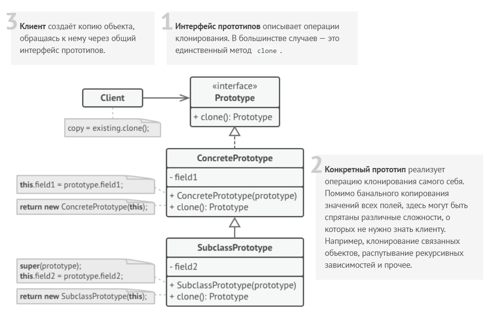

<details> 
<summary>Псевдокод</summary>
<p>

```java
// Базовый прототип.
abstract class Shape is
    field X: int
    field Y: int
    field color: string

    // Копирование всех полей объекта происходит в конструкторе.
    constructor Shape(source: Shape) is
        if (source != null) then
            this.X = source.X
            this.Y = source.Y
            this.color = source.color

    // Результатом операции клонирования всегда будет объект из
    // иерархии классов Shape.
    abstract method clone(): Shape


// Конкретный прототип. Метод клонирования создаёт новый объект
// текущего класса, передавая в его конструктор ссылку на
// собственный объект. Благодаря этому операция клонирования
// получается атомарной — пока не выполнится конструктор, нового
// объекта ещё не существует. Но как только конструктор завершит
// работу, мы получим полностью готовый объект-клон, а не пустой
// объект, который нужно ещё заполнить.
class Rectangle extends Shape is
    field width: int
    field height: int

    constructor Rectangle(source: Rectangle) is
        // Вызов родительского конструктора нужен, чтобы
        // скопировать потенциальные приватные поля, объявленные
        // в родительском классе.
        super(source)
        if (source != null) then
            this.width = source.width
            this.height = source.height

    method clone(): Shape is
        return new Rectangle(this)


class Circle extends Shape is
    field radius: int

    constructor Circle(source: Circle) is
        super(source)
        if (source != null) then
            this.radius = source.radius

    method clone(): Shape is
        return new Circle(this)


// Где-то в клиентском коде.
class Application is
    field shapes: array of Shape

    constructor Application() is
        Circle circle = new Circle()
        circle.X = 10
        circle.Y = 20
        circle.radius = 15
        shapes.add(circle)

        Circle anotherCircle = circle.clone()
        shapes.add(anotherCircle)
        // anotherCircle будет содержать точную копию circle.

        Rectangle rectangle = new Rectangle()
        rectangle.width = 10
        rectangle.height = 20
        shapes.add(rectangle)

    method businessLogic() is
        // Не очевидный плюс Прототипа в том, что вы можете
        // клонировать набор объектов, не зная их конкретных
        // классов.
        Array shapesCopy = new Array of Shapes.

        // Например, мы не знаем, какие конкретно объекты
        // находятся внутри массива shapes, так как он объявлен
        // с типом Shape. Но благодаря полиморфизму, мы можем
        // клонировать все объекты «вслепую». Будет выполнен
        // метод clone того класса, которым является этот
        // объект.
        foreach (s in shapes) do
            shapesCopy.add(s.clone())

        // Переменная shapesCopy будет содержать точные копии
        // элементов массива shapes.
```

</p>
</details>

### Одиночка (Singleton)
[Одиночка](https://refactoring.guru/ru/design-patterns/singleton) — это порождающий паттерн проектирования, который гарантирует, что у класса есть только один экземпляр, и предоставляет к нему глобальную точку доступа.

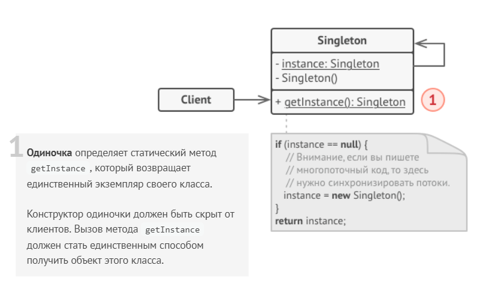

<details> 
<summary>Псевдокод</summary>
<p>

```java
class Database is
    private field instance: Database

    // Метод получения одиночки.
    static method getInstance() is
        if (this.instance == null) then
            acquireThreadLock() and then
                // На всякий случай ещё раз проверим, не был ли
                // объект создан другим потоком, пока текущий
                // ждал освобождения блокировки.
                if (this.instance == null) then
                    this.instance = new Database()
        return this.instance

    private constructor Database() is
        // Здесь может жить код инициализации подключения к
        // серверу баз данных.
        // ...

    public method query(sql) is
        // Все запросы к базе данных будут проходить через этот
        // метод. Поэтому имеет смысл поместить сюда какую-то
        // логику кеширования.
        // ...

class Application is
    method main() is
        Database foo = Database.getInstance()
        foo.query("SELECT ...")
        // ...
        Database bar = Database.getInstance()
        bar.query("SELECT ...")
        // Переменная "bar" содержит тот же объект, что и
        // переменная "foo".
```

</p>
</details>

# [Структурные паттерны](https://refactoring.guru/ru/design-patterns/structural-patterns) (Structural patterns)

### Адаптер (Adapter)
[Адаптер](https://refactoring.guru/ru/design-patterns/adapter) — это структурный паттерн проектирования, который позволяет объектам с несовместимыми интерфейсами работать вместе.

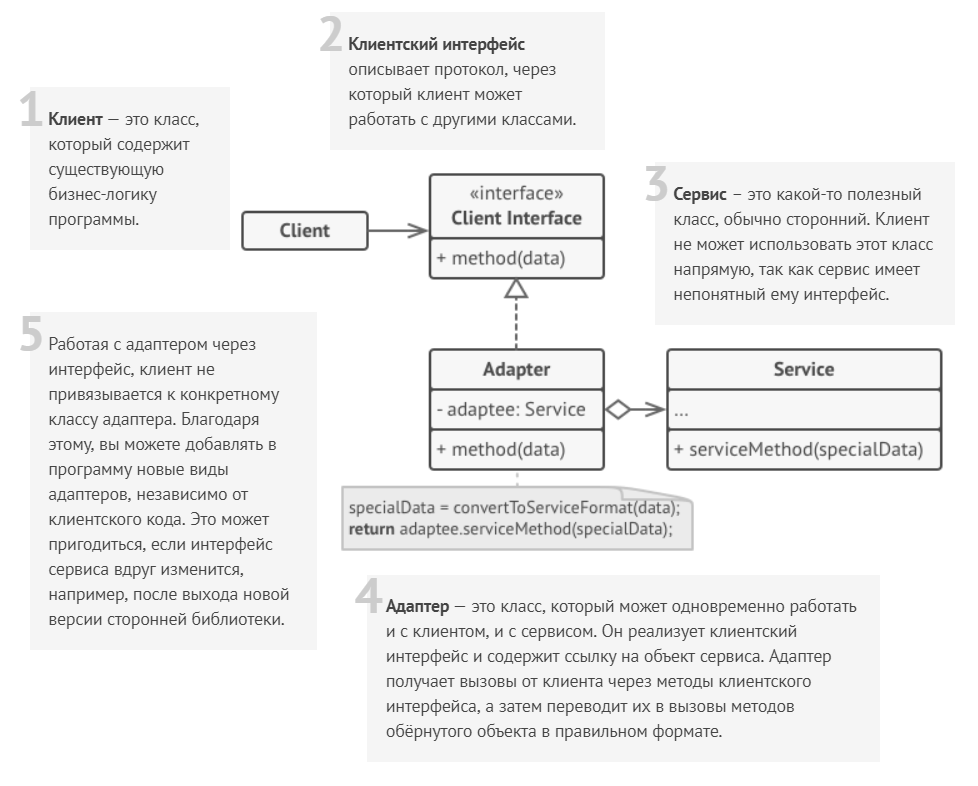

<details> 
<summary>Псевдокод</summary>
<p>
    
```java
// Классы с совместимыми интерфейсами: КруглоеОтверстие и
// КруглыйКолышек.
class RoundHole is
    constructor RoundHole(radius) { ... }

    method getRadius is
        // Вернуть радиус отверстия.

    method fits(peg: RoundPeg) is
        return this.getRadius() >= peg.radius()

class RoundPeg is
    constructor RoundPeg(radius) { ... }

    method getRadius() is
        // Вернуть радиус круглого колышка.


// Устаревший, несовместимый класс: КвадратныйКолышек.
class SquarePeg is
    constructor SquarePeg(width) { ... }

    method getWidth() is
        // Вернуть ширину квадратного колышка.


// Адаптер позволяет использовать квадратные колышки и круглые
// отверстия вместе.
class SquarePegAdapter extends RoundPeg is
    private field peg: SquarePeg

    constructor SquarePegAdapter(peg: SquarePeg) is
        this.peg = peg

    method getRadius() is
        // Вычислить половину диагонали квадратного колышка по
        // теореме Пифагора.
        return Math.sqrt(2 * Math.pow(peg.getWidth(), 2)) / 2


// Где-то в клиентском коде.
hole = new RoundHole(5)
rpeg = new RoundPeg(5)
hole.fits(rpeg) // TRUE

small_sqpeg = new SquarePeg(2)
large_sqpeg = new SquarePeg(5)
hole.fits(small_sqpeg) // Ошибка компиляции, несовместимые типы

small_sqpeg_adapter = new SquarePegAdapter(small_sqpeg)
large_sqpeg_adapter = new SquarePegAdapter(large_sqpeg)
hole.fits(small_sqpeg_adapter) // TRUE
hole.fits(large_sqpeg_adapter) // FALSE
```

</p>
</details>

### Мост (Bridge)
[Мост](https://refactoring.guru/ru/design-patterns/bridge) — это структурный паттерн проектирования, который разделяет один или несколько классов на две отдельные иерархии — абстракцию и реализацию, позволяя изменять их независимо друг от друга.

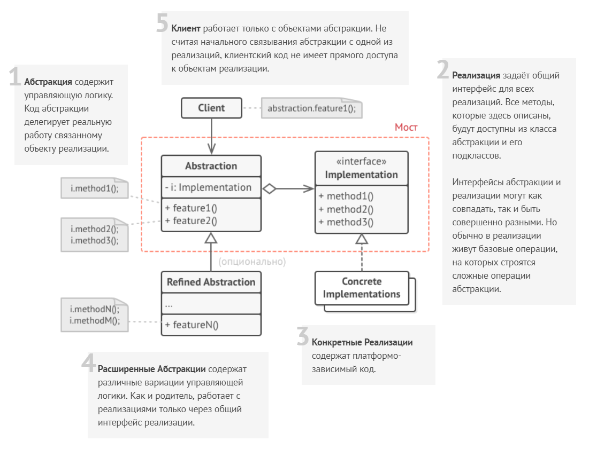

<details> 
<summary>Псевдокод</summary>
<p>

```java
// Класс пультов имеет ссылку на устройство, которым управляет.
// Методы этого класса делегируют работу методам связанного
// устройства.
class Remote is
    protected field device: Device
    constructor Remote(device: Device) is
        this.device = device
    method togglePower() is
        if (device.isEnabled()) then
            device.disable()
        else
            device.enable()
    method volumeDown() is
        device.setVolume(device.getVolume() - 10)
    method volumeUp() is
        device.setVolume(device.getVolume() + 10)
    method channelDown() is
        device.setChannel(device.getChannel() - 1)
    method channelUp() is
        device.setChannel(device.getChannel() + 1)


// Вы можете расширять класс пультов, не трогая код устройств.
class AdvancedRemote extends Remote is
    method mute() is
        device.setVolume(0)


// Все устройства имеют общий интерфейс. Поэтому с ними может
// работать любой пульт.
interface Device is
    method isEnabled()
    method enable()
    method disable()
    method getVolume()
    method setVolume(percent)
    method getChannel()
    method setChannel(channel)


// Но каждое устройство имеет особую реализацию.
class Tv implements Device is
    // ...

class Radio implements Device is
    // ...


// Где-то в клиентском коде.
tv = new Tv()
remote = new Remote(tv)
remote.power()

radio = new Radio()
remote = new AdvancedRemote(radio)
```

</p>
</details>

### Компоновщик (Composite)
[Компоновщик](https://refactoring.guru/ru/design-patterns/composite) — это структурный паттерн проектирования, который позволяет сгруппировать множество объектов в древовидную структуру, а затем работать с ней так, как будто это единичный объект.

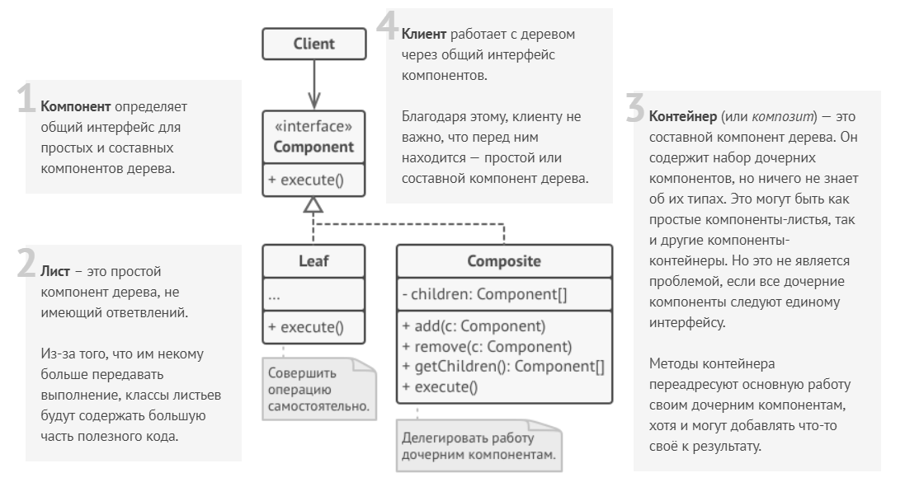

<details> 
<summary>Псевдокод</summary>
<p>

```java
// Общий интерфейс компонентов.
interface Graphic is
    method move(x, y)
    method draw()

// Простой компонент.
class Dot implements Graphic is
    field x, y

    constructor Dot(x, y) { ... }

    method move(x, y) is
        this.x += x, this.y += y

    method draw() is
        // Нарисовать точку в координате X, Y.

// Компоненты могут расширять другие компоненты.
class Circle extends Dot is
    field radius

    constructor Circle(x, y, radius) { ... }

    method draw() is
        // Нарисовать окружность в координате X, Y и радиусом R.

// Контейнер содержит операции добавления/удаления дочерних
// компонентов. Все стандартные операции интерфейса компонентов
// он делегирует каждому из дочерних компонентов.
class CompoundGraphic implements Graphic is
    field children: array of Graphic

    method add(child: Graphic) is
        // Добавить компонент в список дочерних.

    method remove(child: Graphic) is
        // Убрать компонент из списка дочерних.

    method move(x, y) is
        foreach (child in children) do
            child.move(x, y)

    method draw() is
        // 1. Для каждого дочернего компонента:
        //     - Отрисовать компонент.
        //     - Определить координаты максимальной границы.
        // 2. Нарисовать пунктирную границу вокруг всей области.


// Приложение работает единообразно как с единичными
// компонентами, так и с целыми группами компонентов.
class ImageEditor is
    method load() is
        all = new CompoundGraphic()
        all.add(new Dot(1, 2))
        all.add(new Circle(5, 3, 10))
        // ...

    // Группировка выбранных компонентов в один сложный
    // компонент.
    method groupSelected(components: array of Graphic) is
        group = new CompoundGraphic()
        group.add(components)
        all.remove(components)
        all.add(group)
        // Все компоненты будут отрисованы.
        all.draw()
```

</p>
</details>

### Декоратор (Decorator)
[Декоратор](https://refactoring.guru/ru/design-patterns/decorator) — это структурный паттерн проектирования, который позволяет динамически добавлять объектам новую функциональность, оборачивая их в полезные «обёртки».

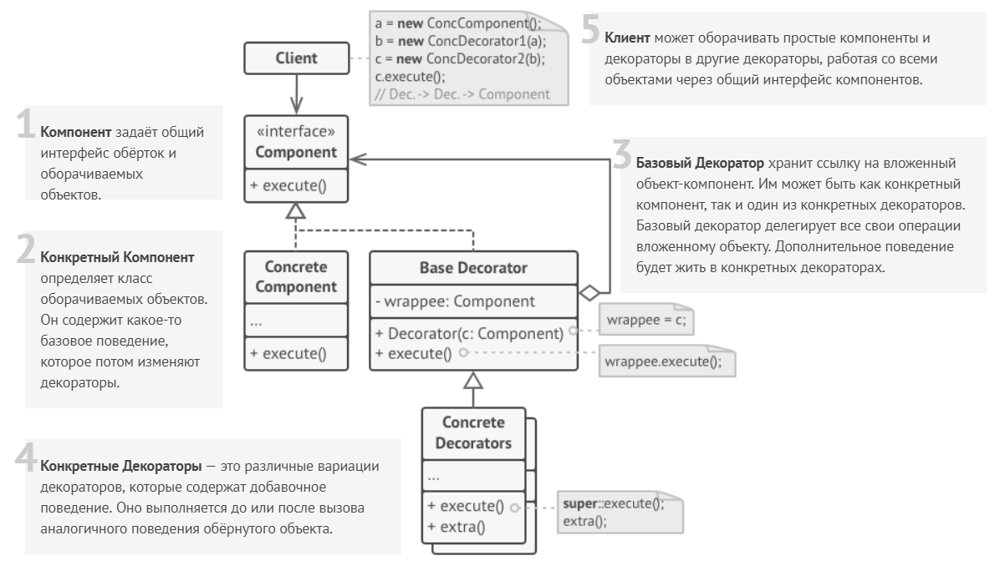

<details> 
<summary>Псевдокод</summary>
<p>

```java
// Общий интерфейс компонентов.
interface DataSource is
    method writeData(data)
    method readData():data

// Один из конкретных компонентов реализует базовую
// функциональность.
class FileDataSource implements DataSource is
    constructor FileDataSource(filename) { ... }

    method writeData(data) is
        // Записать данные в файл.

    method readData():data is
        // Прочитать данные из файла.

// Родитель всех декораторов содержит код обёртывания.
class DataSourceDecorator implements DataSource is
    protected field wrappee: DataSource

    constructor DataSourceDecorator(source: DataSource) is
        wrappee = source

    method writeData(data) is
        wrappee.writeData(data)

    method readData():data is
        return wrappee.readData()

// Конкретные декораторы добавляют что-то своё к базовому
// поведению обёрнутого компонента.
class EncyptionDecorator extends DataSourceDecorator is
    method writeData(data) is
        // 1. Зашифровать поданные данные.
        // 2. Передать зашифрованные данные в метод writeData
        // обёрнутого объекта (wrappee).

    method readData():data is
        // 1. Получить данные из метода readData обёрнутого
        // объекта (wrappee).
        // 2. Расшифровать их, если они зашифрованы.
        // 3. Вернуть результат.

// Декорировать можно не только базовые компоненты, но и уже
// обёрнутые объекты.
class CompressionDecorator extends DataSourceDecorator is
    method writeData(data) is
        // 1. Запаковать поданные данные.
        // 2. Передать запакованные данные в метод writeData
        // обёрнутого объекта (wrappee).

    method readData():data is
        // 1. Получить данные из метода readData обёрнутого
        // объекта (wrappee).
        // 2. Распаковать их, если они запакованы.
        // 3. Вернуть результат.


// Вариант 1. Простой пример сборки и использования декораторов.
class Application is
    method dumbUsageExample() is
        source = new FileDataSource("somefile.dat")
        source.writeData(salaryRecords)
        // В файл были записаны чистые данные.

        source = new CompressionDecorator(source)
        source.writeData(salaryRecords)
        // В файл были записаны сжатые данные.

        source = new EncyptionDecorator(source)
        // Сейчас в source находится связка из трёх объектов:
        // Encryption > Compression > FileDataSource

        source.writeData(salaryRecords)
        // В файл были записаны сжатые и зашифрованные данные.


// Вариант 2. Клиентский код, использующий внешний источник
// данных. Класс SalaryManager ничего не знает о том, как именно
// будут считаны и записаны данные. Он получает уже готовый
// источник данных.
class SalaryManager is
    field source: DataSource

    constructor SalaryManager(source: DataSource) { ... }

    method load() is
        return source.readData()

    method save() is
        source.writeData(salaryRecords)
    // ...Остальные полезные методы...


// Приложение может по-разному собирать декорируемые объекты, в
// зависимости от условий использования.
class ApplicationConfigurator is
    method configurationExample() is
        source = new FileDataSource("salary.dat")
        if (enabledEncryption)
            source = new EncyptionDecorator(source)
        if (enabledCompression)
            source = new CompressionDecorator(source)

        logger = new SalaryManager(source)
        salary = logger.load()
    // ...
```

</p>
</details>

### Фасад (Facade)
[Фасад](https://refactoring.guru/ru/design-patterns/facade) — это структурный паттерн проектирования, который предоставляет простой интерфейс к сложной системе классов, библиотеке или фреймворку.

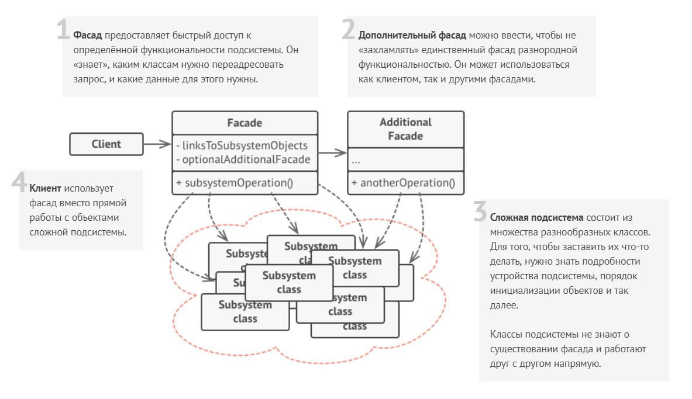

<details> 
<summary>Псевдокод</summary>
<p>

```java
// Классы сложного стороннего фреймворка конвертации видео. Мы
// не контролируем этот код, поэтому не можем его упростить.

class VideoFile
// ...

class OggCompressionCodec
// ...

class MPEG4CompressionCodec
// ...

class CodecFactory
// ...

class BitrateReader
// ...

class AudioMixer
// ...


// Вместо этого мы создаём Фасад — простой интерфейс для работы
// со сложным фреймворком. Фасад не имеет всей функциональности
// фреймворка, но зато скрывает его сложность от клиентов.
class VideoConverter is
    method convert(filename, format):File is
        file = new VideoFile(filename)
        sourceCodec = new CodecFactory.extract(file)
        if (format == "mp4")
            distinationCodec = new MPEG4CompressionCodec()
        else
            distinationCodec = new OggCompressionCodec()
        buffer = BitrateReader.read(filename, sourceCodec)
        result = BitrateReader.convert(buffer, distinationCodec)
        result = (new AudioMixer()).fix(result)
        return new File(result)

// Приложение не зависит от сложного фреймворка конвертации
// видео. Кстати, если вы вдруг решите сменить фреймворк, вам
// нужно будет переписать только класс фасада.
class Application is
    method main() is
        convertor = new VideoConverter()
        mp4 = convertor.convert("youtubevideo.ogg", "mp4")
        mp4.save()
```

</p>
</details>

### Приспособленец/Легковес (Flyweight)
[Легковес](https://refactoring.guru/ru/design-patterns/flyweight) — это структурный паттерн проектирования, который позволяет вместить бóльшее количество объектов в отведённую оперативную память. Легковес экономит память, разделяя общее состояние объектов между собой, вместо хранения одинаковых данных в каждом объекте.

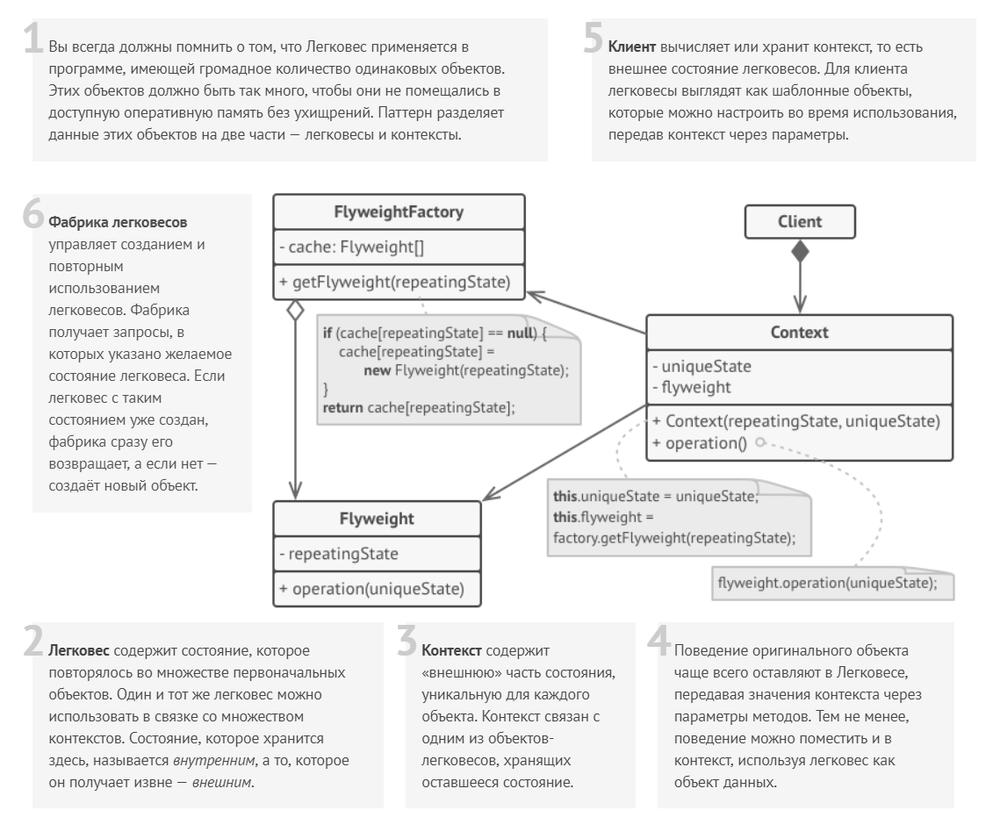

<details> 
<summary>Псевдокод</summary>
<p>

```java
// Этот класс-легковес содержит часть полей, которые описывают
// деревья. Эти поля не уникальны для каждого дерева, в отличие,
// например, от координат: несколько деревьев могут иметь ту же
// текстуру.
//
// Поэтому мы переносим повторяющиеся данные в один-единственный
// объект и ссылаемся на него из множества отдельных деревьев.
class TreeType is
    field name
    field color
    field texture
    constructor TreeType(name, color, texture) { ... }
    method draw(canvas, x, y) is
        // 1. Создать картинку данного типа, цвета и текстуры.
        // 2. Нарисовать картинку на холсте в позиции X, Y.

// Фабрика легковесов решает, когда нужно создать новый
// легковес, а когда можно обойтись существующим.
class TreeFactory is
    static field treeTypes: collection of tree types
    static method getTreeType(name, color, texture) is
        type = treeTypes.find(name, color, texture)
        if (type == null)
            type = new TreeType(name, color, texture)
            treeTypes.add(type)
        return type

// Контекстный объект, из которого мы выделили легковес
// TreeType. В программе могут быть тысячи объектов Tree, так
// как накладные расходы на их хранение совсем небольшие — в
// памяти нужно держать всего три целых числа (две координаты и
// ссылка).
class Tree is
    field x,y
    field type: TreeType
    constructor Tree(x, y, type) { ... }
    method draw(canvas) is
        type.draw(canvas, this.x, this.y)

// Классы Tree и Forest являются клиентами Легковеса. При
// желании их можно слить в один класс, если вам не нужно
// расширять класс деревьев далее.
class Forest is
    field trees: collection of Trees

    method plantTree(x, y, name, color, texture) is
        type = TreeFactory.getTreeType(name, color, texture)
        tree = new Tree(x, y, type)
        trees.add(tree)

    method draw(canvas) is
        foreach (tree in trees) do
            tree.draw(canvas)
```

</p>
</details>

### Заместитель (Proxy)
[Заместитель](https://refactoring.guru/ru/design-patterns/proxy) — это структурный паттерн проектирования, который позволяет подставлять вместо реальных объектов специальные объекты-заменители. Эти объекты перехватывают вызовы к оригинальному объекту, позволяя сделать что-то до или после передачи вызова оригиналу.

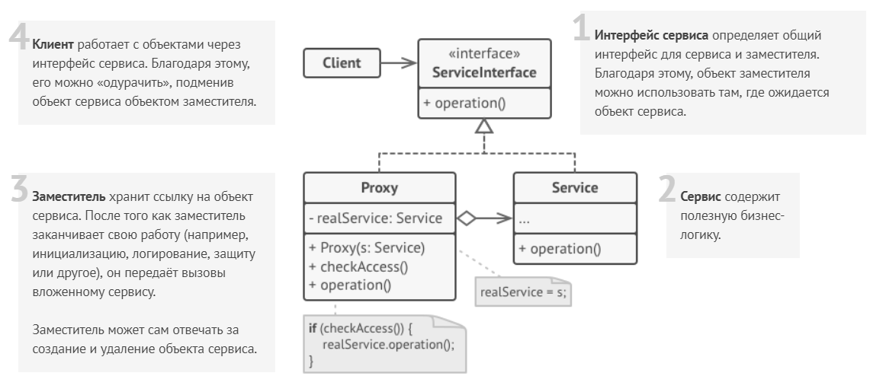

<details> 
<summary>Псевдокод</summary>
<p>

```java
// Интерфейс удалённого сервиса.
interface ThirdPartyYoutubeLib is
    method listVideos()
    method getVideoInfo(id)
    method downloadVideo(id)

// Конкретная реализация сервиса. Методы этого класса
// запрашивают у Youtube различную информацию. Скорость запроса
// зависит не только от качества интернет-канала пользователя,
// но и от состояния самого Youtube. Значит, чем больше будет
// вызовов к сервису, тем менее отзывчивой станет программа.
class ThirdPartyYoutubeClass is
    method listVideos() is
        // Получить список видеороликов с помощью API Youtube.

    method getVideoInfo(id) is
        // Получить детальную информацию о каком-то видеоролике.

    method downloadVideo(id) is
        // Скачать видео с Youtube.

// С другой стороны, можно кешировать запросы к Youtube и не
// повторять их какое-то время, пока кеш не устареет. Но внести
// этот код напрямую в сервисный класс нельзя, так как он
// находится в сторонней библиотеке. Поэтому мы поместим логику
// кеширования в отдельный класс-обёртку. Он будет делегировать
// запросы к сервисному объекту, только если нужно
// непосредственно выслать запрос.
class CachedYoutubeClass implements ThirdPartyYoutubeLib is
    private field service: ThirdPartyYoutubeClass
    private field listCache, videoCache
    field needReset

    constructor CachedYoutubeClass(service: ThirdPartyYoutubeLib) is
        this.service = service

    method listVideos() is
        if (listCache == null || needReset)
            listCache = service.listVideos()
        return listCache

    method getVideoInfo(id) is
        if (videoCache == null || needReset)
            videoCache = service.getVideoInfo(id)
        return videoCache

    method downloadVideo(id) is
        if (!downloadExists(id) || needReset)
            service.downloadVideo(id)

// Класс GUI, который использует сервисный объект. Вместо
// реального сервиса, мы подсунем ему объект-заместитель. Клиент
// ничего не заметит, так как заместитель имеет тот же
// интерфейс, что и сервис.
class YoutubeManager is
    protected field service: ThirdPartyYoutubeLib

    constructor YoutubeManager(service: ThirdPartyYoutubeLib) is
        this.service = service

    method renderVideoPage() is
        info = service.getVideoInfo()
        // Отобразить страницу видеоролика.

    method renderListPanel() is
        list = service.listVideos()
        // Отобразить список превьюшек видеороликов.

    method reactOnUserInput() is
        renderVideoPage()
        renderListPanel()

// Конфигурационная часть приложения создаёт и передаёт клиентам
// объект заместителя.
class Application is
    method init() is
        youtubeService = new ThirdPartyYoutubeClass()
        youtubeProxy = new CachedYoutubeClass(youtubeService)
        manager = new YoutubeManager(youtubeProxy)
        manager.reactOnUserInput()
```

</p>
</details>

# [Поведенческие паттерны](https://refactoring.guru/ru/design-patterns/behavioral-patterns) (Behavioral patterns)

### Цепочка обязанностей (Chain of Responsibility)
[Цепочка обязанностей](https://refactoring.guru/ru/design-patterns/chain-of-responsibility) — это поведенческий паттерн проектирования, который позволяет передавать запросы последовательно по цепочке обработчиков. Каждый последующий обработчик решает, может ли он обработать запрос сам и стоит ли передавать запрос дальше по цепи.


<details> 
<summary>Псевдокод</summary>
<p>

```java
// Интерфейс обработчиков.
interface ComponentWithContextualHelp is
    method showHelp()


// Базовый класс простых компонентов.
abstract class Component implements ComponentWithContextualHelp is
    field tooltipText: string

    // Контейнер, содержащий компонент, служит в качестве
    // следующего звена цепочки.
    protected field container: Container

    // Базовое поведение компонента заключается в том, чтобы
    // показать всплывающую подсказку, если для неё задан текст.
    // В обратном случае — перенаправить запрос своему
    // контейнеру, если тот существует.
    method showHelp() is
        if (tooltipText != null)
            // Показать подсказку.
        else
            container.showHelp()


// Контейнеры могут включать в себя как простые компоненты, так
// и другие контейнеры. Здесь формируются связи цепочки. Класс
// контейнера унаследует метод showHelp от своего родителя —
// базового компонента.
abstract class Container extends Component is
    protected field children: array of Component

    method add(child) is
        children.add(child)
        child.container = this


// Большинство примитивных компонентов устроит базовое поведение
// показа помощи через подсказку, которое они унаследуют из
// класса Component.
class Button extends Component is
    // ...

// Но сложные компоненты могут переопределять метод показа
// помощи по-своему. Но и в этом случае они всегда могут
// вернуться к базовой реализации, вызвав метод родителя.
class Panel extends Container is
    field modalHelpText: string

    method showHelp() is
        if (modalHelpText != null)
            // Показать модальное окно с помощью.
        else
            super.showHelp()

// ...то же, что и выше...
class Dialog extends Container is
    field wikiPageURL: string

    method showHelp() is
        if (wikiPageURL != null)
            // Открыть страницу Wiki в браузере.
        else
            super.showHelp()


// Клиентский код.
class Application is
    // Каждое приложение конфигурирует цепочку по-своему.
    method createUI() is
        dialog = new Dialog("Budget Reports")
        dialog.wikiPage = "http://..."
        panel = new Panel(0, 0, 400, 800)
        panel.modalHelpText = "This panel does..."
        ok = new Button(250, 760, 50, 20, "OK")
        ok.tooltipText = "This is a OK button that..."
        cancel = new Button(320, 760, 50, 20, "Cancel")
        // ...
        panel.add(ok)
        panel.add(cancel)
        dialog.add(panel)

    // Представьте, что здесь произойдёт.
    method onF1KeyPress() is
        component = this.getComponentAtMouseCoords()
        component.showHelp()
```

</p>
</details>

### Комманда (Command)
[Комманда](https://refactoring.guru/ru/design-patterns/command) — это поведенческий паттерн проектирования, который позволяет передавать запросы последовательно по цепочке обработчиков. Каждый последующий обработчик решает, может ли он обработать запрос сам и стоит ли передавать запрос дальше по цепи.

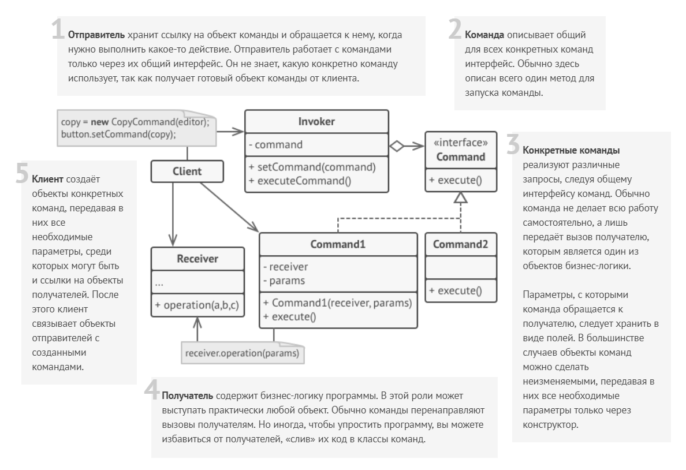

<details> 
<summary>Псевдокод</summary>
<p>

```java
// Абстрактная команда задаёт общий интерфейс для конкретных
// классов команд и содержит базовое поведение отмены операции.
abstract class Command is
    protected field app: Application
    protected field editor: Editor
    protected field backup: text

    constructor Command(app: Application, editor: Editor) is
        this.app = app
        this.editor = editor

    // Сохраняем состояние редактора.
    method saveBackup() is
        backup = editor.text

    // Восстанавливаем состояние редактора.
    method undo() is
        editor.text = backup

    // Главный метод команды остаётся абстрактным, чтобы каждая
    // конкретная команда определила его по-своему. Метод должен
    // возвратить true или false в зависимости о того, изменила
    // ли команда состояние редактора, а значит, нужно ли её
    // сохранить в истории.
    abstract method execute()


// Конкретные команды.
class CopyCommand extends Command is
    // Команда копирования не записывается в историю, так как
    // она не меняет состояние редактора.
    method execute() is
        app.clipboard = editor.getSelection()
        return false

class CutCommand extends Command is
    // Команды, меняющие состояние редактора, сохраняют
    // состояние редактора перед своим действием и сигнализируют
    // об изменении, возвращая true.
    method execute() is
        saveBackup()
        app.clipboard = editor.getSelection()
        editor.deleteSelection()
        return true

class PasteCommand extends Command is
    method execute() is
        saveBackup()
        editor.replaceSelection(app.clipboard)
        return true

// Отмена — это тоже команда.
class UndoCommand extends Command is
    method execute() is
        app.undo()
        return false


// Глобальная история команд — это стек.
class CommandHistory is
    private field history: array of Command

    // Последний зашедший...
    method push(c: Command) is
        // Добавить команду в конец массива-истории.

    // ...выходит первым.
    method pop():Command is
        // Достать последнюю команду из массива-истории.


// Класс редактора содержит непосредственные операции над
// текстом. Он отыгрывает роль получателя – команды делегируют
// ему свои действия.
class Editor is
    field text: string

    method getSelection() is
        // Вернуть выбранный текст.

    method deleteSelection() is
        // Удалить выбранный текст.

    method replaceSelection(text) is
        // Вставить текст из буфера обмена в текущей позиции.


// Класс приложения настраивает объекты для совместной работы.
// Он выступает в роли отправителя — создаёт команды, чтобы
// выполнить какие-то действия.
class Application is
    field clipboard: string
    field editors: array of Editors
    field activeEditor: Editor
    field history: CommandHistory

    // Код, привязывающий команды к элементам интерфейса, может
    // выглядеть примерно так.
    method createUI() is
        // ...
        copy = function() {executeCommand(
            new CopyCommand(this, activeEditor)) }
        copyButton.setCommand(copy)
        shortcuts.onKeyPress("Ctrl+C", copy)

        cut = function() { executeCommand(
            new CutCommand(this, activeEditor)) }
        cutButton.setCommand(cut)
        shortcuts.onKeyPress("Ctrl+X", cut)

        paste = function() { executeCommand(
            new PasteCommand(this, activeEditor)) }
        pasteButton.setCommand(paste)
        shortcuts.onKeyPress("Ctrl+V", paste)

        undo = function() { executeCommand(
            new UndoCommand(this, activeEditor)) }
        undoButton.setCommand(undo)
        shortcuts.onKeyPress("Ctrl+Z", undo)

    // Запускаем команду и проверяем, надо ли добавить её в
    // историю.
    method executeCommand(command) is
        if (command.execute())
            history.push(command)

    // Берём последнюю команду из истории и заставляем её все
    // отменить. Мы не знаем конкретный тип команды, но это и не
    // важно, так как каждая команда знает, как отменить своё
    // действие.
    method undo() is
        command = history.pop()
        if (command != null)
            command.undo()
```

</p>
</details>

### Итератор (Iterator)
[Итератор](https://refactoring.guru/ru/design-patterns/iterator) — это поведенческий паттерн проектирования, который позволяет передавать запросы последовательно по цепочке обработчиков. Каждый последующий обработчик решает, может ли он обработать запрос сам и стоит ли передавать запрос дальше по цепи.

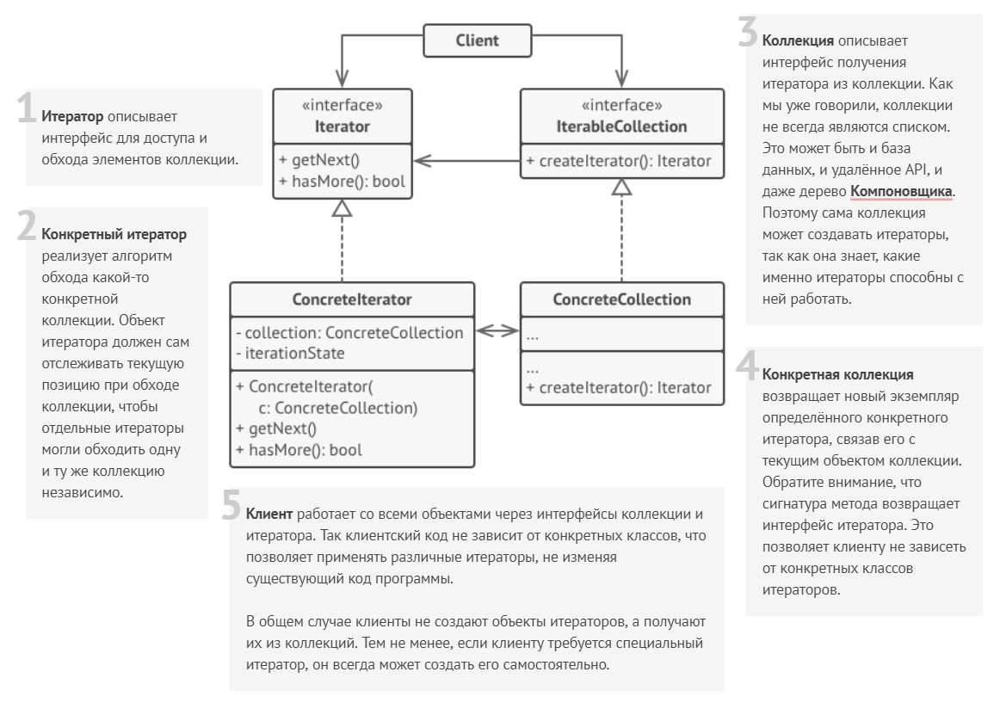

<details> 
<summary>Псевдокод</summary>
<p>

```java
// Общий интерфейс коллекций должен определить фабричный метод
// для производства итератора. Можно определить сразу несколько
// методов, чтобы дать пользователям различные варианты обхода
// одной и той же коллекции.
interface SocialNetwork is
    method createFriendsIterator(profileId): ProfileIterator
    method createCoworkersIterator(profileId): ProfileIterator


// Конкретная коллекция знает, объекты каких итераторов нужно
// создавать.
class Facebook implements SocialNetwork is
    // ...Основной код коллекции...

    // Код получения нужного итератора.
    method createFriendsIterator(profileId) is
        return new FacebookIterator(this, profileId, "friends")
    method createCoworkersIterator(profileId) is
        return new FacebookIterator(this, profileId, "coworkers")


// Общий интерфейс итераторов.
interface ProfileIterator is
    method getNext(): Profile
    method hasMore(): bool


// Конкретный итератор.
class FacebookIterator implements ProfileIterator is
    // Итератору нужна ссылка на коллекцию, которую он обходит.
    private field facebook: Facebook
    private field profileId, type: string

    // Но каждый итератор обходит коллекцию, независимо от
    // остальных, поэтому он содержит информацию о текущей
    // позиции обхода.
    private field currentPosition
    private field cache: array of Profile

    constructor FacebookIterator(facebook, profileId, type) is
        this.facebook = network
        this.profileId = profileId
        this.type = type

    private method lazyInit() is
        if (cache == null)
            cache = facebook.sendSophisticatedSocialGraphRequest(profileId, type)

    // Итератор реализует методы базового интерфейса по-своему.
    method getNext() is
        if (hasMore())
            currentPosition++
            return cache[currentPosition]

    method hasMore() is
        lazyInit()
        return cache.length < currentPosition


// Вот ещё полезная тактика: мы можем передавать объект
// итератора вместо коллекции в клиентские классы. При таком
// подходе клиентский код не будет иметь доступа к коллекциям, а
// значит, его не будут волновать подробности их реализаций. Ему
// будет доступен только общий интерфейс итераторов.
class SocialSpammer is
    method send(iterator: ProfileIterator, message: string) is
        while (iterator.hasNext())
            profile = iterator.getNext()
            System.sendEmail(profile.getEmail(), message)


// Класс приложение конфигурирует классы, как захочет.
class Application is
    field network: SocialNetwork
    field spammer: SocialSpammer

    method config() is
        if working with Facebook
            this.network = new Facebook()
        if working with LinkedIn
            this.network = new LinkedIn()
        this.spammer = new SocialSpammer()

    method sendSpamToFriends(profile) is
        iterator = network.createFriendsIterator(profile.getId())
        spammer.send(iterator, "Very important message")

    method sendSpamToCoworkers(profile) is
        iterator = network.createCoworkersIterator(profile.getId())
        spammer.send(iterator, "Very important message")
```

</p>
</details>

### Посредник (Mediator)
[Посредник](https://refactoring.guru/ru/design-patterns/mediator) — это поведенческий паттерн проектирования, который позволяет передавать запросы последовательно по цепочке обработчиков. Каждый последующий обработчик решает, может ли он обработать запрос сам и стоит ли передавать запрос дальше по цепи.

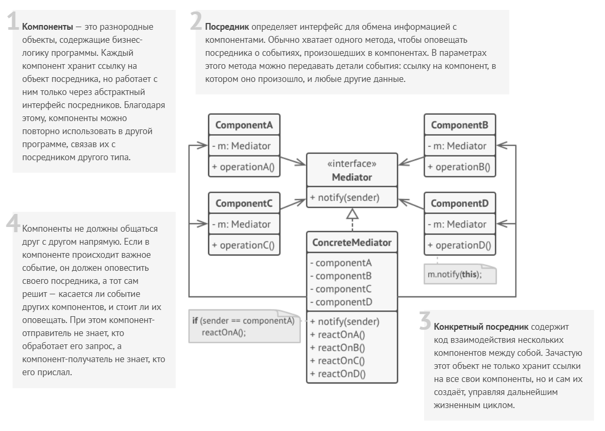

<details> 
<summary>Псевдокод</summary>
<p>

```java
// Общий интерфейс посредников.
interface Mediator is
    method notify(sender: Component, event: string)


// Конкретный посредник. Все связи между конкретными
// компонентами переехали в код посредника. Он получает
// извещения от своих компонентов и знает, как на них
// реагировать.
class AuthenticationDialog implements Mediator is
    private field title: string
    private field loginOrRegisterChkBx: Checkbox
    private field loginUsername, loginPassword: Textbox
    private field registrationUsername, registrationPassword
    private field registrationEmail: Textbox
    private field okBtn, cancelBtn: Button

    constructor AuthenticationDialog() is
        // Здесь нужно создать объекты всех компонентов, подав
        // текущий объект-посредник в их конструктор.

    // Когда что-то случается с компонентом, он шлёт посреднику
    // оповещение. После получения извещения посредник может
    // либо сделать что-то самостоятельно, либо перенаправить
    // запрос другому компоненту.
    method notify(sender, event) is
        if (sender == loginOrRegisterChkBx and event == "check")
            if (loginOrRegisterChkBx.checked)
                title = "Log in"
                // 1. Показать компоненты формы входа.
                // 2. Скрыть компоненты формы регистрации.
            else
                title = "Register"
                // 1. Показать компоненты формы регистрации.
                // 2. Скрыть компоненты формы входа.

        if (sender == okBtn && event == "click")
            if (loginOrRegister.checked)
                // Попробовать найти пользователя с данными из
                // формы логина.
                if (!found)
                    // Показать ошибку над формой логина.
            else
                // 1. Создать пользовательский аккаунт с данными
                // из формы регистрации.
                // 2. Авторизировать этого пользователя.
                // ...


// Классы компонентов общаются с посредниками через их общий
// интерфейс. Благодаря этому одни и те же компоненты можно
// использовать в разных посредниках.
class Component is
    field dialog: Mediator

    constructor Component(dialog) is
        this.dialog = dialog

    method click() is
        dialog.notify(this, "click")

    method keypress() is
        dialog.notify(this, "keypress")

// Конкретные компоненты не связаны между собой напрямую. У них
// есть только один канал общения — через отправку уведомлений
// посреднику.
class Button extends Component is
    // ...

class Textbox extends Component is
    // ...

class Checkbox extends Component is
    method check() is
        dialog.notify(this, "check")
    // ...
```

</p>
</details>

### Хранитель/Снимок (Memento)!!!
[Снимок](https://refactoring.guru/ru/design-patterns/memento) — это поведенческий паттерн проектирования, который позволяет сохранять и восстанавливать прошлые состояния объектов, не раскрывая подробностей их реализации.

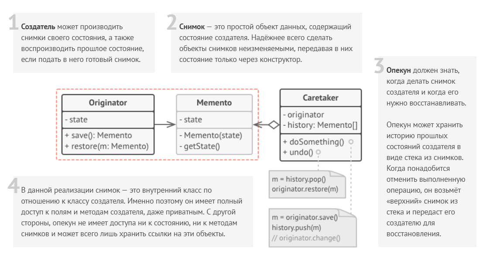

<details> 
<summary>Псевдокод</summary>
<p>

```java
// Класс создателя должен иметь специальный метод, который
// сохраняет состояние создателя в новом объекте-снимке.
class Editor is
    private field text, curX, curY, selectionWidth

    method setText(text) is
        this.text = text

    method setCursor(x, y) is
        this.curX = curX
        this.curY = curY

    method setSelectionWidth(width) is
        this.selectionWidth = width

    method createSnapshot(): Snapshot is
        // Снимок — неизменяемый объект, поэтому Создатель
        // передаёт все своё состояние через параметры
        // конструктора.
        return new Snapshot(this, text, curX, curY, selectionWidth)

// Снимок хранит прошлое состояние редактора.
class Snapshot is
    private field editor: Editor
    private field text, curX, curY, selectionWidth

    constructor Snapshot(editor, text, curX, curY, selectionWidth) is
        this.editor = editor
        this.text = text
        this.curX = curX
        this.curY = curY
        this.selectionWidth = selectionWidth

    // В нужный момент владелец снимка может восстановить
    // состояние редактора.
    method restore() is
        editor.setText(text)
        editor.setCursor(curX, curY)
        editor.setSelectionWidth(selectionWidth)

// Опекуном может выступать класс команд (см. паттерн Команда).
// В этом случае команда сохраняет снимок состояния объекта-
// получателя, перед тем как передать ему своё действие. А в
// случае отмены команда вернёт объект в прежнее состояние.
class Command is
    private field backup: Snapshot

    method makeBackup() is
        backup = editor.saveState()

    method undo() is
        if (backup != null)
            backup.restore()
    // ...
```

</p>
</details>

### Наблюдатель (Observer)
[Наблюдатель](https://refactoring.guru/ru/design-patterns/observer) — это поведенческий паттерн проектирования, который создаёт механизм подписки, позволяющий одним объектам следить и реагировать на события, происходящие в других объектах.

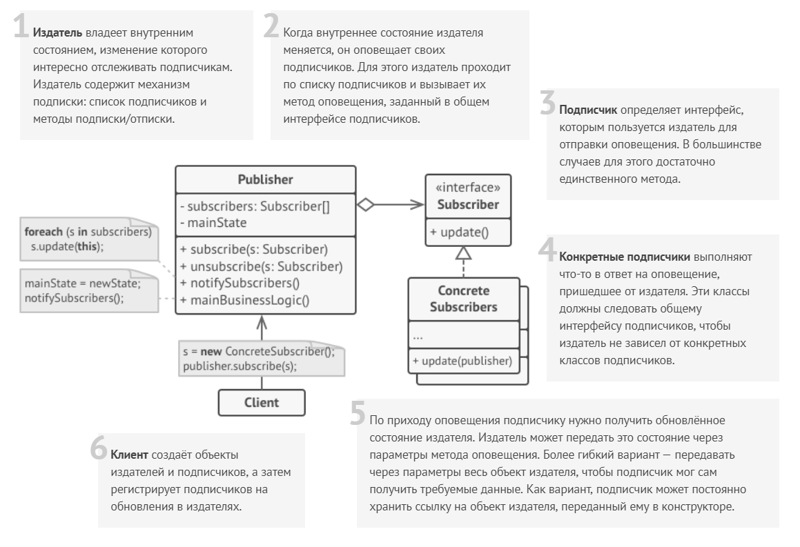

<details> 
<summary>Псевдокод</summary>
<p>

```java
// Базовый класс-издатель. Содержит код управления подписчиками
// и их оповещения.
class EventManager is
    private field listeners: hash map of event types and listeners

    method subscribe(eventType, listener) is
        listeners.add(eventType, listener)

    method unsubscribe(eventType, listener) is
        listeners.remove(eventType, listener)

    method notify(eventType, data) is
        foreach (listener in listeners.of(eventType)) do
            listener.update(data)

// Конкретный класс-издатель, содержащий интересную для других
// компонентов бизнес-логику. Мы могли бы сделать его прямым
// потомком EventManager, но в реальной жизни это не всегда
// возможно (например, если у класса уже есть родитель). Поэтому
// здесь мы подключаем механизм подписки при помощи композиции.
class Editor is
    private field events: EventManager
    private field file: File

    constructor Editor() is
        events = new EventManager()

    // Методы бизнес-логики, которые оповещают подписчиков об
    // изменениях.
    method openFile(path) is
        this.file = new File(path)
        events.notify("open", file.name)

    method saveFile() is
        file.write()
        events.notify("save", file.name)
    // ...


// Общий интерфейс подписчиков. Во многих языках, поддерживающих
// функциональные типы, можно обойтись без этого интерфейса и
// конкретных классов, заменив объекты подписчиков функциями.
interface EventListener is
    method update(filename)

// Набор конкретных подписчиков. Они реализуют добавочную
// функциональность, реагируя на извещения от издателя.
class LoggingListener is
    private field log: File
    private field message

    constructor LoggingListener(log_filename, message) is
        this.log = new File(log_filename)
        this.message = message

    method update(filename) is
        log.write(replace('%s',filename,message))

class EmailAlertsListener is
    private field email: string

    constructor EmailAlertsListener(email, message) is
        this.email = email
        this.message = message

    method update(filename) is
        system.email(email, replace('%s',filename,message))


// Приложение может сконфигурировать издателей и подписчиков как
// угодно, в зависимости от целей и окружения.
class Application is
    method config() is
        editor = new TextEditor()

        logger = new LoggingListener(
            "/path/to/log.txt",
            "Someone has opened file: %s");
        editor.events.subscribe("open", logger)

        emailAlers = new EmailAlertsListener(
            "admin@example.com",
            "Someone has changed the file: %s")
        editor.events.subscribe("save", emailAlers)
```

</p>
</details>

### Состояние (State)
[Состояние](https://refactoring.guru/ru/design-patterns/state) — это поведенческий паттерн проектирования, который позволяет объектам менять поведение в зависимости от своего состояния. Извне создаётся впечатление, что изменился класс объекта.

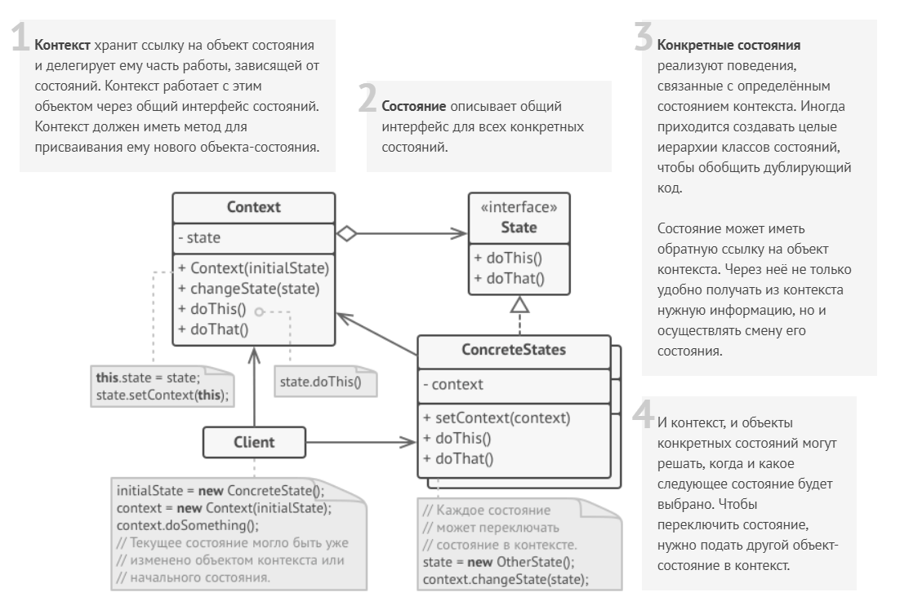

<details> 
<summary>Псевдокод</summary>
<p>

```java
// Общий интерфейс всех состояний.
abstract class State is
    protected field player: Player

    // Контекст передаёт себя в конструктор состояния, чтобы
    // состояние могло обращаться к его данным и методам в
    // будущем, если потребуется.
    constructor State(player) is
        this.player = player

    abstract method clickLock()
    abstract method clickPlay()
    abstract method clickNext()
    abstract method clickPrevious()


// Конкретные состояния реализуют методы абстрактного состояния
// по-своему.
class LockedState extends State is

    // При разблокировке проигрователя с заблокированными
    // клавишами он может принять одно из двух состояний.
    method clickLock() is
        if (player.playing)
            player.changeState(new PlayingState(player))
        else
            player.changeState(new ReadyState(player))

    method clickPlay() is
        // Ничего не делать.

    method clickNext() is
        // Ничего не делать.

    method clickPrevious() is
        // Ничего не делать.


// Конкретные состояния сами могут переводить контекст в другое
// состояние.
class ReadyState extends State is
    method clickLock() is
        player.changeState(new LockedState(player))

    method clickPlay() is
        player.startPlayback()
        player.changeState(new PlayingState(player))

    method clickNext() is
        player.nextSong()

    method clickPrevious() is
        player.previousSong()


class PlayingState extends State is
    method clickLock() is
        player.changeState(new LockedState(player))

    method clickPlay() is
        player.stopPlayback()
        player.changeState(new ReadyState(player))

    method clickNext() is
        if (event.doubleclick)
            player.nextSong()
        else
            player.fastForward(5)

    method clickPrevious() is
        if (event.doubleclick)
            player.previous()
        else
            player.rewind(5)


// Проигрыватель выступает в роли контекста.
class Player is
    field state: State
    field UI, volume, playlist, currentSong

    constructor Player() is
        this.state = new ReadyState(this)

        // Контекст заставляет состояние реагировать на
        // пользовательский ввод вместо себя. Реакция может быть
        // разной, в зависимости от того, какое состояние сейчас
        // активно.
        UI = new UserInterface()
        UI.lockButton.onClick(this.clickLock)
        UI.playButton.onClick(this.clickPlay)
        UI.nextButton.onClick(this.clickNext)
        UI.prevButton.onClick(this.clickPrevious)

    // Другие объекты тоже должны иметь возможность заменять
    // состояние проигрывателя.
    method changeState(state: State) is
        this.state = state

    // Методы UI будут делегировать работу активному состоянию.
    method clickLock() is
        state.clickLock()
    method clickPlay() is
        state.clickPlay()
    method clickNext() is
        state.clickNext()
    method clickPrevious() is
        state.clickPrevious()

    // Сервисные методы контекста, вызываемые состояниями.
    method startPlayback() is
        // ...
    method stopPlayback() is
        // ...
    method nextSong() is
        // ...
    method previousSong() is
        // ...
    method fastForward(time) is
        // ...
    method rewind(time) is
        // ...
```

</p>
</details>

### Стратегия (Strategy)
[Стратегия](https://refactoring.guru/ru/design-patterns/strategy) — это поведенческий паттерн проектирования, который определяет семейство схожих алгоритмов и помещает каждый из них в собственный класс, после чего алгоритмы можно взаимозаменять прямо во время исполнения программы.

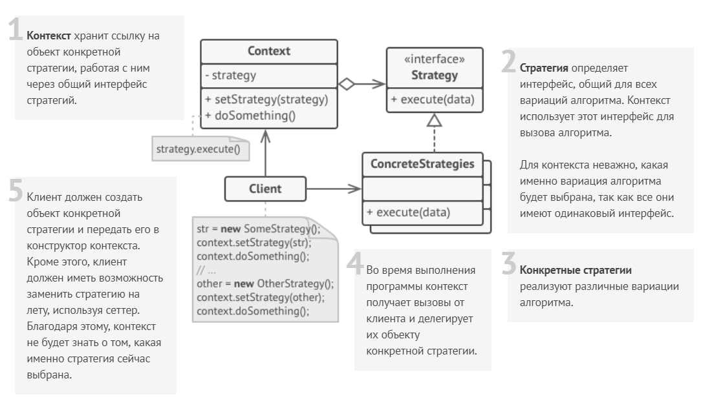

<details> 
<summary>Псевдокод</summary>
<p>

```java
// Общий интерфейс всех стратегий.
interface Strategy is
    method execute(a, b)

// Каждая конкретная стратегия реализует общий интерфейс своим
// способом.
class ConcreteStrategyAdd implements Strategy is
    method execute(a, b) is
        return a + b

class ConcreteStrategySubtract implements Strategy is
    method execute(a, b) is
        return a - b

class ConcreteStrategyMultiply implements Strategy is
    method execute(a, b) is
        return a * b

// Контекст всегда работает со стратегиями через общий
// интерфейс. Он не знает, какая именно стратегия ему подана.
class Context is
    private strategy: Strategy

    method setStrategy(Strategy strategy) is
        this.strategy = strategy

    method executeStrategy(int a, int b) is
        return strategy.execute(a, b)


// Конкретная стратегия выбирается на более высоком уровне,
// например, конфигуратором всего приложения. Готовый
// объект-стратегия подаётся в клиентский объект, а затем может
// быть заменён другой стратегией в любой момент на лету.
class ExampleApplication is
    method main() is
        // 1. Создать объект контекста.
        // 2. Получить первое число (n1).
        // 3. Получить второе число (n2).
        // 4. Получить желаемую операцию.
        // 5. Затем, выбрать стратегию:

        if (action == addition) then
            context.setStrategy(new ConcreteStrategyAdd())

        if (action == subtraction) then
            context.setStrategy(new ConcreteStrategySubtract())

        if (action == multiplication) then
            context.setStrategy(new ConcreteStrategyMultiply())

        // 6. Выполнить операцию с помощью стратегии:
        result = context.executeStrategy(n1, n2)

        // 7. Вывести результат на экран.
```

</p>
</details>

### Шаблонный метод (Template Method)
[Шаблонный метод](https://refactoring.guru/ru/design-patterns/template-method) — это поведенческий паттерн проектирования, который определяет скелет алгоритма, перекладывая ответственность за некоторые его шаги на подклассы. Паттерн позволяет подклассам переопределять шаги алгоритма, не меняя его общей структуры.

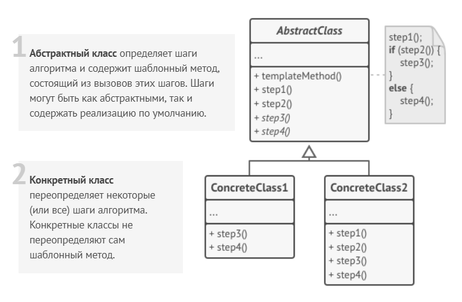

<details> 
<summary>Псевдокод</summary>
<p>

```java
class GameAI is
    // Шаблонный метод должен быть задан в базовом классе. Он
    // состоит из вызовов методов в определённом порядке. Чаще
    // всего эти методы являются шагами некоего алгоритма.
    method turn() is
        collectResources()
        buildNewStructures()
        buildUnits()
        attack()

    // Некоторые из этих методов могут быть реализованы прямо в
    // базовом классе.
    method collectResources() is
        foreach (s in this.builtStructures) do
            s.collect()

    // А некоторые могут быть полностью абстрактными.
    abstract method buildStructures()
    abstract method buildUnits()

    // Кстати, шаблонных методов в классе может быть несколько.
    method attack() is
        enemy = closestEnemy()
        if (enemy == null)
            sendScouts(map.center)
        else
            sendWarriors(enemy.position)

    abstract method sendScouts(position)
    abstract method sendWarriors(position)

// Подклассы могут предоставлять свою реализацию шагов
// алгоритма, не изменяя сам шаблонный метод.
class OrcsAI extends GameAI is
    method buildStructures() is
        if (there are some resources) then
            // Строить фермы, затем бараки, а потом цитадель.

    method buildUnits() is
        if (there are plenty of resources) then
            if (there are no scouts)
                // Построить раба и добавить в группу
                // разведчиков.
            else
                // Построить пехотинца и добавить в группу
                // воинов.

    // ...

    method sendScouts(position) is
        if (scouts.length > 0) then
            // Отправить разведчиков на позицию.

    method sendWarriors(position) is
        if (warriors.length > 5) then
            // Отправить воинов на позицию.

// Подклассы могут не только реализовывать абстрактные шаги, но
// и переопределять шаги, уже реализованные в базовом классе.
class MonstersAI extends GameAI is
    method collectResources() is
        // Ничего не делать.

    method buildStructures() is
        // Ничего не делать.

    method buildUnits() is
        // Ничего не делать.
```

</p>
</details>

### Посетитель (Visitor)
[Посетитель](https://refactoring.guru/ru/design-patterns/visitor) — это поведенческий паттерн проектирования, который позволяет добавлять в программу новые операции, не изменяя классы объектов, над которыми эти операции могут выполняться.

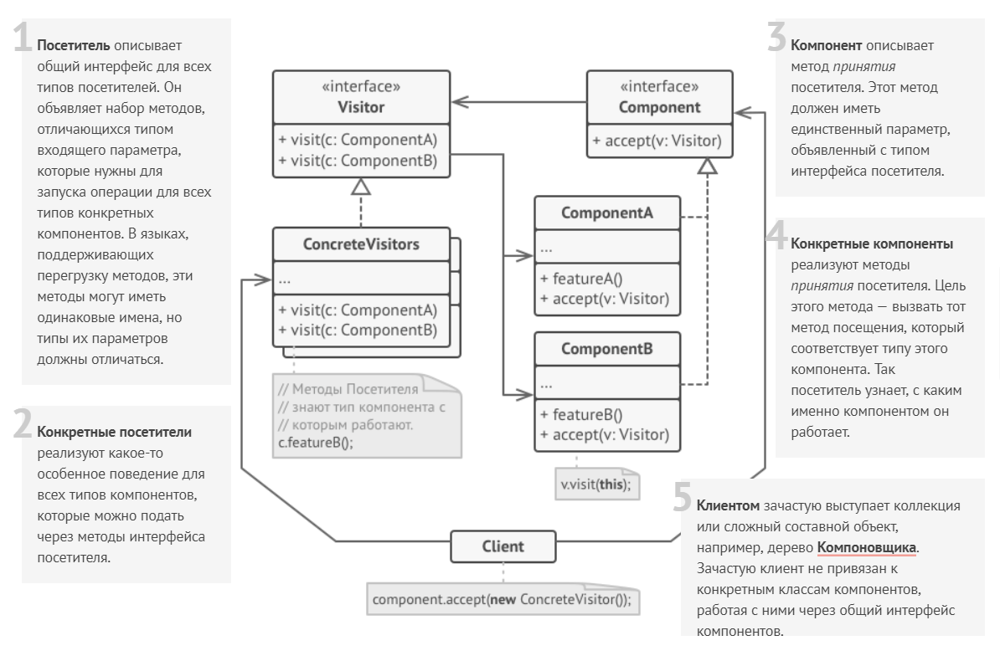

<details> 
<summary>Псевдокод</summary>
<p>

```java
// Сложная иерархия компонентов.
interface Shape is
    method move(x, y)
    method draw()
    method accept(v: Visitor)

// Метод принятия посетителя должен быть реализован в каждом
// компоненте, а не только в базовом классе. Это поможет
// программе определить, какой метод посетителя нужно вызвать,
// если вы не знаете тип компонента.
class Dot extends Shape is
    // ...
    method accept(v: Visitor) is
        v.visitDot(this)

class Circle extends Dot is
    // ...
    method accept(v: Visitor) is
        v.visitCircle(this)

class Rectangle extends Shape is
    // ...
    method accept(v: Visitor) is
        v.visitRectangle(this)

class CompoundShape implements Shape is
    // ...
    method accept(v: Visitor) is
        v.visitCompoundShape(this)


// Интерфейс посетителей должен содержать методы посещения
// каждого компонента. Важно, чтобы иерархия компонентов
// менялась редко, так как при добавлении нового компонента
// придётся менять всех существующих посетителей.
interface Visitor is
    method visitDot(d: Dot)
    method visitCircle(c: Circle)
    method visitRectangle(r: Rectangle)
    method visitCompoundShape(cs: CompoundShape)

// Конкретный посетитель реализует одну операцию для всей
// иерархии компонентов. Новая операция = новый посетитель.
// Посетитель выгодно применять, когда новые компоненты
// добавляются очень редко, а новые операции — часто.
class XMLExportVisitor is
    method visitDot(d: Dot) is
        // Экспорт id и координат центра точки.

    method visitCircle(c: Circle) is
        // Экспорт id, кординат центра и радиуса окружности.

    method visitRectangle(r: Rectangle) is
        // Экспорт id, кординат левого-верхнего угла, ширины и
        // высоты прямоугольника.

    method visitCompoundShape(cs: CompoundShape) is
        // Экспорт id составной фигуры, а также списка id
        // подфигур, из которых она состоит.


// Приложение может применять посетителя к любому набору
// объектов компонентов, даже не уточняя их типы. Нужный метод
// посетителя будет выбран благодаря проходу через метод accept.
class Application is
    field allShapes: array of Shapes

    method export() is
        exportVisitor = new XMLExportVisitor()

        foreach (shape in allShapes) do
            shape.accept(exportVisitor)
```

</p>
</details>